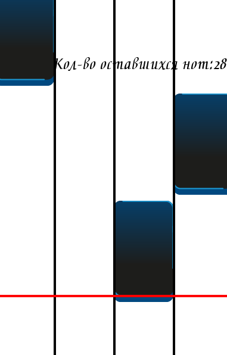
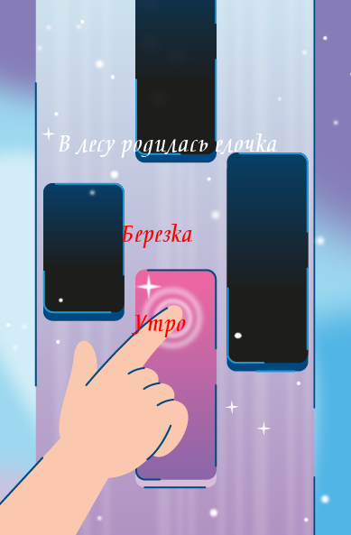

# Игра "пианино"
## Описание
Онлан-игра на пианино, которая позволяет играть на пианино,не имея физического инструмента.
## Возможности игры
- Выбор песни с помощью стрелок на клавиатруре.
- Показ оставшегося количества нот во время игры.
- Возможен выход из игры и выбор другой песни.
- При пропуске одной клавиши будет показана надпись "Вы проиграли!".
- В конце игры будет показана надпись "Вы выиграли!".
## Чему научилась
- Новая структура проекта, использующая объектно-ориентированное
программирование как основу.
- Создание универсальной вертикальной игровой сетки.
- Появление объектов в случайном месте, но в пределах игровой
сетки.
- Обработка кликов по мышке по игровым объектам.
- Cмена ненажатой ноты на нажатую.
- Усложнённое управление списком объектов.
- Выбор пунктов в меню с помощью клавиатуры.
- Усложнённая работа со звуками: затухание, каналы, регулировка
громкости.
## Работа игры
### Игра

### Меню

